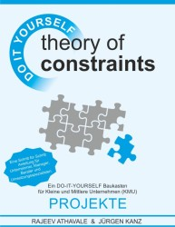
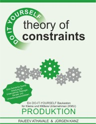
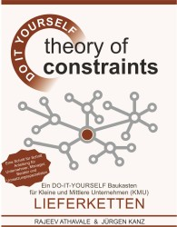

# My-Books-Papers
## Overview of my published books

I have published three books related to the TOC - Theory Of Constraints in German language. Here are the links to the landing pages on LeanPub:
  

    
  
***Theory of Constraints - PROJEKTE - Ein DO-IT-YOURSELF Baukasten für Kleine und Mittlere Unternehmen (KMU).***  
Eine Schritt-für-Schritt-Anleitung für Unternehmer, Manager, Berater und Umsetzungsspezialisten.  
von Rajeev Athavale und Jürgen Kanz  

<https://leanpub.com/germantocdiyprojects>

***______________________________________________________________________________________________________________***  
  
  
  
***Theory of Constraints - PRODUKTION - Ein DO-IT-YOURSELF Baukasten für Kleine und Mittlere Unternehmen (KMU).***  
Eine Schritt-für-Schritt-Anleitung für Unternehmer, Manager, Berater und Umsetzungsspezialisten.  
von Rajeev Athavale und Jürgen Kanz  
  
<https://leanpub.com/germantocdiymanufacturing>  
  
***______________________________________________________________________________________________________________*** 
  
  
   
***Theory of Constraints - LIEFERKETTEN - Ein DO-IT-YOURSELF Baukasten für Kleine und Mittlere Unternehmen (KMU).***  
Eine Schritt-für-Schritt-Anleitung für Unternehmer, Manager, Berater und Umsetzungsspezialisten.  
von Rajeev Athavale und Jürgen Kanz 
  
<https://leanpub.com/germantocdiydistribution>  
  
***______________________________________________________________________________________________________________*** 
***______________________________________________________________________________________________________________*** 
  
## Overview of recent papers

[Industry 4.0 - Overview and TOC Opportunities, (2016)](https://github.com/JuergenKanz/My-Books-Papers/blob/4b0d9044a9aeb0a7dd512dbd0a1457e135de6b19/Kanz_29%20TOCPA_11-12%20Nov%202016_Vilnius_Handout.pdf)

[TOC Thinking and Management Trends, (2017)](https://github.com/JuergenKanz/My-Books-Papers/blob/0b77f395bd7a320ace4be045e758dd552f6b4665/Kanz_31_TOCPA_Finland_9%20Mar%202017%234.pdf)

[The big slogan and the potential real value of Industry 4.0, (2018)](https://elischragenheim.com/2018/10/01/the-big-slogan-and-the-potential-real-value-of-industry-4-0/)

Presentation videos are available on request.

